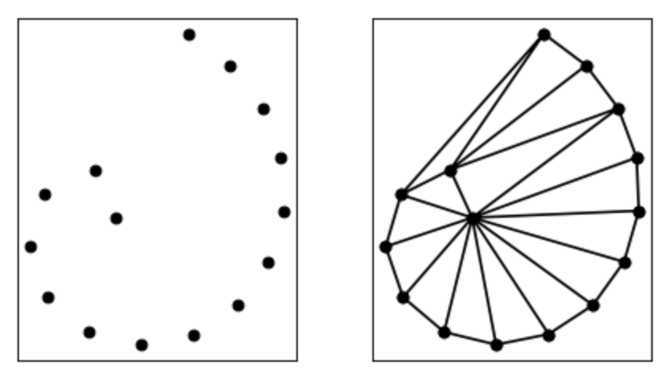
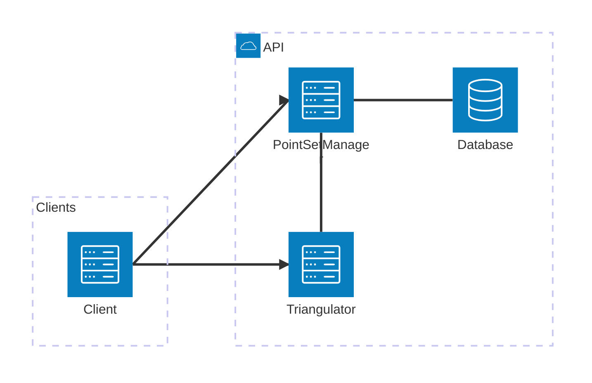

# Techniques de Test - TP 2025/2026

## Introduction

Le but de ce TP est de mettre en pratique un ensemble de tests dans le but de
valider et mesurer la fiabilité, la justesse, la performance et la qualité de
l'implémentation d'un composant que vous allez réaliser.

Le point le plus important est que vous mettiez en place tous les tests qui
permettent de vérifier votre implémentation. Votre implémentation elle-même
est secondaire; mais il est tout de même attendu que vos tests vous mènent à
une implémentation complète.

Une attention toute particulière sera donc mise sur la qualité et surtout sur la
pertinence de votre setup de test.

## Description du projet

L'objet du TP sera la réalisation et le test d'un micro-service de triangulation.
La triangulation est une opération qui consiste à calculer des triangles à partir
d'un ensemble de points. Si vous voulez en savoir plus, vous pouvez aller lire
[Wikipédia](https://fr.wikipedia.org/wiki/Triangulation_d%27un_ensemble_de_points),
ou demander à un LLM de vous expliquer.



### Architecture générale

Le schéma suivant décrit l'architecture générale dans laquelle le composant que
vous devez réaliser (le `Triangulator`) s'inscrit.



### Rôle de chaque composant

#### PointSetManager

Le `PointSetManager` se concentre sur la gestion des ensembles de points, il permet :
- l'enregistrement de nouveaux ensembles de points
- la récupération d'ensembles de points existants

Ces fonctionnalités sont accessibles au travers d'une API HTTP qui est décrite
dans sa spécification OpenAPI [point_set_manager.yml](point_set_manager.yml).

#### Database

Sert uniquement à l'enregistrement des ensembles de points.

#### Triangulator

C'est ce composant qui sera l'objet de vos travaux.

Le `Triangulator` permet de calculer la triangulation des ensembles de points.
Comme il ne stocke aucune données lui-même, il doit récupérer les ensembles
de points auprès du `PointSetManager` pour pouvoir réaliser les calculs.

Cette fonctionnalité est également accessible au travers d'une API HTTP,
décrite dans sa spécification OpenAPI [triangulator.yml](triangulator.yml).

#### Client

Réalise des requêtes auprès des autres composants selon ses besoins.

### Workflow général

Le workflow typique est le suivant:
- Le `Client` envoie un `PointSet` au `PointSetManager` pour enregistrement
- Le `PointSetManager` enregistre le `PointSet` et renvoie un `PointSetID` au `Client`
- Le `Client` demande une triangulation au `Triangulator` en lui passant un `PointSetID`
- Le `Triangulator` récupère le `PointSet` auprès du `PointSetManager` en lui passant le `PointSetID`
- Le `Triangulator` réalise la triangulation
- Le `Triangulator` répond au `Client` avec les `Triangles` issus de la triangulation

### Représentations de `PointSet` et `Triangles` 

`PointSet` et `Triangles` sont les 2 structures de données complexes qui transitent
entre les composants.  
Compte tenu de la nature des données, il est important que leur représentation soit
compacte, sans quoi les échanges entre les composants seraient coûteux.
C'est pourquoi il a été défini une représentation binaire pour ces deux structures.  
Ces représentations sont attendues pour toutes les communications entre composants,
libre ensuite à chaque composant d'avoir la représentation interne qu'il désire.

#### `PointSet`

`PointSet` est un ensemble de points dans un espace en 2D, chaque point de
l'ensemble se résume donc à 2 coordonnées, X et Y.
La représentation de ces données est assez simple:
- Les 4 premiers bytes représentent un `unsigned long` donnant le nombre de
points dans l'ensemble
- Les bytes suivants représentent les points, avec pour chaque point 8 bytes.
Les 4 premiers bytes sont la coordonnée X (un `float`) et les 4 bytes suivant
la coordonnée Y (un `float` aussi).

#### `Triangles`

`Triangles` représente un ensemble de triangles, dont les sommets sont des
points dans un espace à 2 dimensions, un `PointSet` donc. Il est donc assez
logique que la représentation de `Triangles` soit dérivée de celle de `PointSet`.

La représentation binaire de `Triangles` est donc en deux parties:
- La première partie décrit les sommets et est strictement la même que pour un `PointSet`
- La seconde partie décrit les triangles à proprement parler et se compose de:
  - 4 bytes (un `unsigned long`) qui représente le nombre de triangles
  - 3 x 4 x {nombre de triangles} bytes, pour chaque triangle il y a donc 12 bytes,
    chaque 4 bytes sont un `unsigned long` qui référence l'indice d'un sommet du
    triangle dans le `PointSet`.

## Attendus

### Contraintes techniques

L'idée est d'avoir un environnement Python (3.10+) minimaliste et que vous
implémentiez toute la logique "from scratch". La seule bibliothèque  qui vous
est concédée est `flask`, on est pas cruels au point de vous demander de
réimplémenter un serveur web.
Le lancement de votre serveur `Triangulator` doit donc être possible dans un
environnement ne contenant que les dépendances présentes dans le fichier
`requirements.txt` qui est fourni.

Vous avez aussi à votre disposition les bibliothèques présentes dans le fichier
`dev_requirements.txt`, notamment :
- `pytest` pour mettre au point et exécuter vos test
- `coverage` pour mesurer la couverture de vos tests
- `ruff` pour assurer la qualité de votre code
- `pdoc3` pour générer la documentation automatiquement

### Tests & qualité

#### Tests de comportement

Il est attendu que vous mettiez en place un ensemble de tests unitaires pour
valider le juste comportement de ce que vous développez. Ces tests doivent se
retrouver à plusieurs échelles :
- Au niveau de la triangulation même, pour vérifier que votre algorithme de
  triangulation donne des résultats corrects.
- Au niveau de l'API que votre composant expose, pour vérifier qu'il se conforme
  effectivement à cette API et assurer son comportement bout en bout.

N'oubliez pas de gérer des situations autres que le "happy path", compte tenu
de l'interaction avec le `Client` et le `PointSetManager` beaucoup de problèmes
peuvent apparaître.

#### Couverture

L'objectif est que l'ensemble de votre code soit couvert par des test.
Vous pouvez lancer cet outil avec une commande telle que :
```shell
coverage run -m pytest arg1 arg2 arg3 
```

Attention à ne pas confondre couverture et pertinence, il est tout à fait possible
de couvrir 100% de son code avec des tests totalement bidon et qui n'apportent rien.

#### Tests de performance

La triangulation et la conversion vers/depuis le format binaire peuvent être des
opérations assez gourmandes, il est donc attendu que vous mesuriez les performances
de ces opérations dans différentes conditions que vous estimez pertinentes.  
Compte tenu du temps qu'ils peuvent prendre, les tests à cet effet devront être
différenciés du reste et il doit être possible de les exclure de l'exécution globale
des tests.

#### Qualité de code et documentation

Vous devez vous assurer que votre code maintienit un certain standard de qualité
dans sa rédaction. À cet effet l'outil `ruff` va vous permettre de vérifier que
votre code n'enfreint pas certaines règles (plus ou moins arbitraires). Le fichier
`pyproject.toml` fournit définit une liste de règles assez basiques, incluant le
besoin de documenter l'ensemble de votre code. Le but est donc que la commande
`ruff check` n'ait plus rien à redire sur votre code.  
Comme vous aurez tout bien documenté votre code vous pourrez automatiquement
générer la documentation de votre code grâce au package `pdoc3`.
Vous pouvez ajouter des règles à `ruff` si vous l'estimez pertinent, mais pas en
retirer, on vérifiera. ;)


#### Lancement des différentes opérations

Selon comment vous organisez votre code il est possible que vous ayez besoin
d'adapter les commandes des différentes bibliothèques ou d'y ajouter des arguments.  
Pour vous permettre cette flexibilité tout en ayant une certaine standardisation
il est attendu que vous utilisiez `make` pour définir quelques targets :
- `make test` : lance tous les tests (basé sur `pytest`)
- `make unit_test` : lance tous les tests sauf les tests de performance (basé sur `pytest`)
- `make perf_test` : lance uniquement les tests de performance (basé sur `pytest`)
- `make coverage` : génère un rapport de couverture de code (basé sur `coverage`)
- `make lint` : valide la qualité de code (basé sur `ruff check`)
- `make doc` : génère la documentation en HTML (basé sur `pdoc3`)

## Démarche et rendus

Le but de l'exercice est que vous adoptiez une méthode de développement "test first".
Le problème et les API de chacun des composants sont décrits de manière
suffisamment précise pour que vous puissiez en principe réfléchir de façon complète
aux tests à mettre en place.  
En ce sens; il est attendu que vous mettiez en place vos tests avant même de commencer
les développements. Il est admis que vos tests peuvent évoluer une fois que vous
commencez à implémenter, mais le but est que vous vous forciez à mener cette réflexion
en amont.

Dans cette logique 4 rendus sont attendus :
- Un plan de tests qui décrit dans les grandes lignes les tests que vous prévoyez
  de mettre en place et pourquoi/comment vous prévoyez de les mettre en place.
  Ce plan doit être rendu dans un fichier `PLAN.md` à la racine de votre projet
  et doit être rendu à la fin de la première séance.
- Une version du projet qui n'implémente pas la logique de votre composant mais
  dans laquelle vous avez mis votre plan en application et avez donc tout votre
  setup de test en place. À ce stade c'est normal si tous vos tests sont en erreur.
  Cette version doit être rendue à la fin de la quatrième
  séance.
- Une version du projet avec l'implémentation complétée, qui passe vos tests,
  passe les checks de qualité, permet de générer la documentation, etc.
  Vos tests ont le droit (le devoir?) d'évoluer entre cette version et la
  précédente puisque votre vision théorique se sera heurtée à la réalité.
  Cette version doit être rendue à la fin de la dernière séance.
- Un document `RETEX.md` qui décrit votre retour d'expérience sur le projet.
  En particulier, il est attendu que vous décriviez ce que vous pensez avoir
  bien/mal fait, les choses que vous feriez autrement avec le recul, en quoi
  votre plan initial était bon/mauvais, etc.
  Ce document doit également être rendu à la fin de la dernière séance.

# Bon courage !
